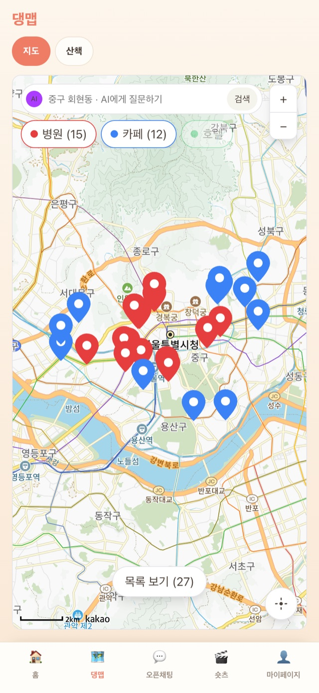
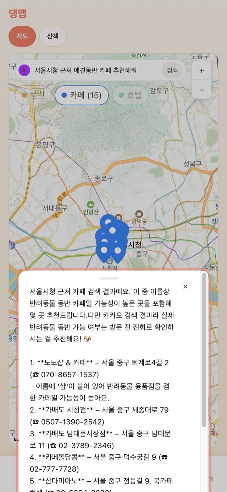
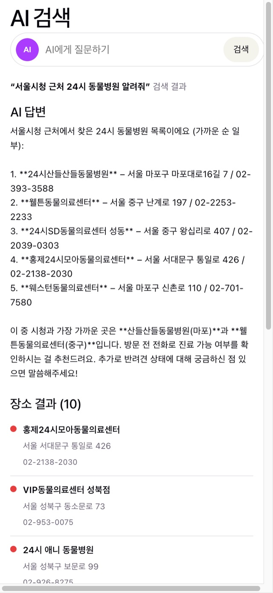
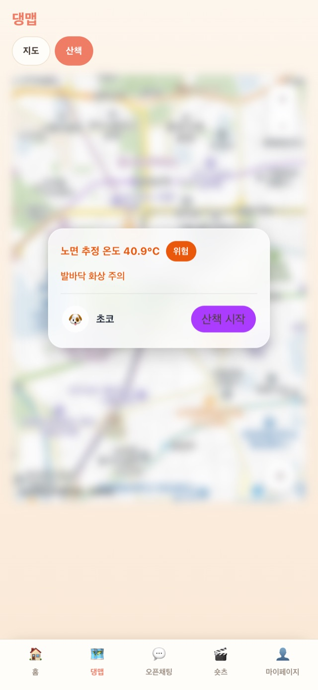
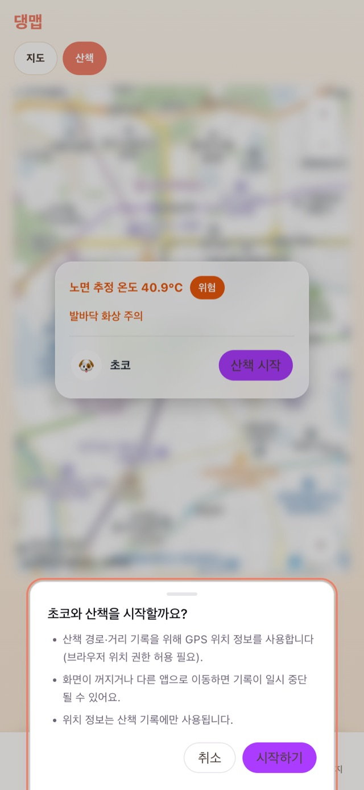
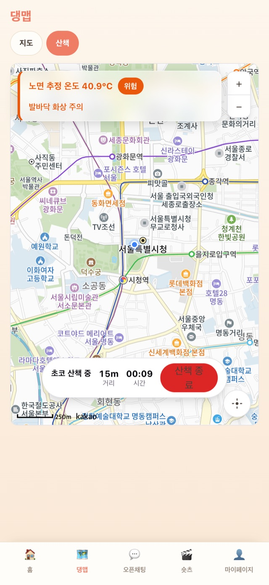

# 댕댕댕 (Pet Care) — 반려견 산책·장소 추천 서비스

반려견 생체정보를 분석해 이상 징후를 알리고, **지도·산책·AI 챗봇**으로 반려견 케어 동선을 제공하는 모바일 웹 서비스입니다.

- 기간: 2026.08 · 4인 팀 프로젝트
- 구성: `pet_backend`(Spring Boot + JPA) · `pet_frontend`(React + Vite, 360px 모바일) · `pet_model`(FastAPI, 피부 진단 ML)
- **이 README는 구영주(백엔드 개발자)의 담당 범위를 기준으로 작성했습니다.** 팀원 담당 영역은 아래 "팀 구성"에 표시했습니다.

## 화면

| 지도 (카테고리 마커 · 목록 시트) | 검색바 = AI 챗봇 (답변 + 마커 갱신) | AI 검색 (답변 / 도구 결과 분리) |
|---|---|---|
|  |  |  |
| **산책 — 노면 온도 판정 게이트** | **GPS 안내** | **트래킹 (경로 · 거리 · 시간)** |
|  |  |  |

## 아키텍처

```
[React 19 / Vite]  ←→  [Spring Boot 3.5 / Java 21 / JPA]  ←→  [FastAPI / PyTorch]
  :5173  카카오맵 SDK          :8080  JWT · Tool Use · MCP           :8000  피부 진단(팀원)
  Geolocation                       │
                     [Supabase PostgreSQL]   ·   카카오 로컬 API · 기상청 단기예보 · Anthropic Claude
```

| 계층 | 스택 |
|---|---|
| 백엔드 | Java 21, Spring Boot 3.5, Spring Data JPA(Hibernate, jsonb), Spring Security(JWT), Spring AI MCP Server, Anthropic Java SDK, Caffeine |
| 프론트 | React 19, Vite, react-router-dom 7, 카카오맵 JS SDK, Geolocation API, oxlint |
| DB | PostgreSQL (Supabase) |
| 외부 API | 카카오 로컬 API(장소), 기상청 단기예보 조회서비스(공공데이터포털) |
| 배포 | AWS EC2 · HTTPS(DuckDNS) · 단일 오리진 리버스 프록시 · GitHub Actions |

## 내가 만든 것 (구영주)

### 백엔드 `pet_backend/src/main/java/com/pet/backend`

| 패키지 | 내용 |
|---|---|
| `aisearch` | `POST /api/ai-search` — Anthropic Java SDK Tool Use 루프. 도구 2종(질병 예측 조회 · 카카오 장소 검색)을 모델이 조합해 "심장질환 의심 → 24시 동물병원" 같은 키워드를 스스로 결정. 검색/대화는 요청의 `mode`로 분기 |
| `place` | `KakaoClient` + `PlaceService` + `GET /api/places` — 카카오 로컬 API 키워드 검색, Caffeine 10분 캐시(약관상 영구 저장 금지), 챗봇·지도가 같은 `places` 스키마 공유 |
| `walk` | `GET /api/walk/weather` — 기상청 초단기실황·예보로 **아스팔트 노면 온도 추정**(간이 열수지 `T = T_air + K·(1−α)·S/(5.7+3.8v)`, 계수는 상수 클래스 분리), 위험 4단계(25/35/50℃). LCC 격자 변환, base_time 규격(실황 HH00/예보 HH30), 키 미설정 시 mock 폴백. `POST/GET /api/walk/records` — 산책 기록(jsonb 경로), petId 소유권 검증. 브리핑 스케줄러(`@Scheduled`, 판정 결과를 DB에 기록 — 문구 생성만 LLM) |
| `mcp` | Spring AI MCP 서버 — 도구 4종(질병 예측·장소 검색·산책 날씨·오늘 브리핑)을 기존 서비스에 위임, stdio 프로파일(로그 stdout 차단)·HTTP 프로파일(:8081), `.mcpb` 패키징 |

테스트: `./gradlew test` — 107건(walk 45건 포함). 기상청 규격을 단언하는 테스트로 base_time 버그를 재발 방지.

### 프론트 `pet_frontend/src`

- `components/PetMap.jsx` — 카카오맵 공용 모듈(카테고리 마커·토글 칩·현위치·경로 폴리라인·상세 시트), 지도 페이지·챗봇 미니 지도·진단 페이지가 재사용
- `pages/.../MapPage.jsx` — 검색바가 곧 AI 챗봇, 지도 이동 재검색(500m 임계), 지역명 역지오코딩, 목록 바텀시트
- `AiSearchPage.jsx` — `?q=` 자동 실행, LLM 답변 / 함수 호출 결과 분리 표시, 최근 검색어
- `pages/walk/WalkPage.jsx`, `hooks/useWalkTracker.js` — 온도 게이트 카드, GPS 안내 팝업, `watchPosition` 노이즈 필터 3종, 하버사인 거리, 저장 실패 재시도
- 공용 승격 — `components/BottomSheet`, `SearchBar`, `PlaceListItem`, `NearbyPlaces`, `hooks/useInitialLocation`, `common/geo.js`·`regionLabel.js`·`mapDefaults.js` (중복 5곳 제거, 접근성 통일)

### 그 외

- `deploy/` — EC2 단일 오리진 배포 구성(리버스 프록시·systemd·절차 문서). 배포 후 지도 미표시를 번들 실측으로 추적해 CI 시크릿 누락·CSS 높이 체인 붕괴 수정
- `.mcp.json`, `pet_backend/mcp-server.sh`, `assistant/` — MCP 진입점과 산책 브리핑 발송 브리지
- QA 총괄 — 기능마다 **QA 기획서 → 검증 → 완료보고서** 3단계(산책 63항목 판정, 보고서 7건), 배포 후 IDOR 재판정·수정
- 병합 유실 4회 복구 — 원인 역추적 후 라우트·설정·상수 복원, 공용 컴포넌트 승격으로 재발 방지

## 실행

### 백엔드

```bash
cd pet_backend
cp .env.example .env          # DB_URL·JWT_SECRET 필수, 나머지 키는 선택
./gradlew bootRun             # :8080
./gradlew test                # 107건
```

- `KMA_SERVICE_KEY`가 없으면 산책 날씨는 mock으로 폴백됩니다. 질병 예측은 `prediction.mode=mock`이 기본입니다.
- Supabase 사용 시 **세션 풀러(5432)** 주소를 권장합니다. 트랜잭션 풀러(6543)는 다른 연결의 read-only 세션이 새어 들어와 INSERT가 거부될 수 있습니다.
- MCP 서버: `./gradlew bootJar && ./mcp-server.sh` (stdio) — 저장소 루트 `.mcp.json`으로 Claude Code에서 자동 인식, MCP Inspector로 검증

### 프론트

```bash
cd pet_frontend
cp .env.example .env          # VITE_BACKEND_URL, VITE_KAKAO_JS_KEY
npm install && npm run dev    # :5173
```

카카오맵 JS 키는 카카오 개발자 콘솔에 **Web 도메인 `http://localhost:5173`** 이 등록돼 있어야 지도가 뜹니다.

### ML 서버 (팀원 담당)

```bash
conda activate pet_model
cd pet_model && uvicorn app.main:app --reload --port 8000
```

## 팀 구성 (4인)

| 영역 | 담당 |
|---|---|
| AI 챗봇·지도·산책·MCP 서버·배포·QA | **구영주** |
| 로그인·JWT·CORS 등 인증/보안 | 팀원 |
| 생체정보 수집·대시보드·오픈채팅·숏츠 | 팀원 |
| 알림 모델·리포트·피부 진단 ML(pet_model) | 팀원 |

## 참고

- 기획·QA 문서(`CLAUDE.md`, `docs/qa/*.md`)는 `.gitignore`의 `*.md` 규칙으로 저장소에 포함되지 않습니다(로컬 관리).
- 배포 서버는 팀 프로젝트 종료 후 정리했습니다. 데모는 로컬 실행으로 재현합니다.
